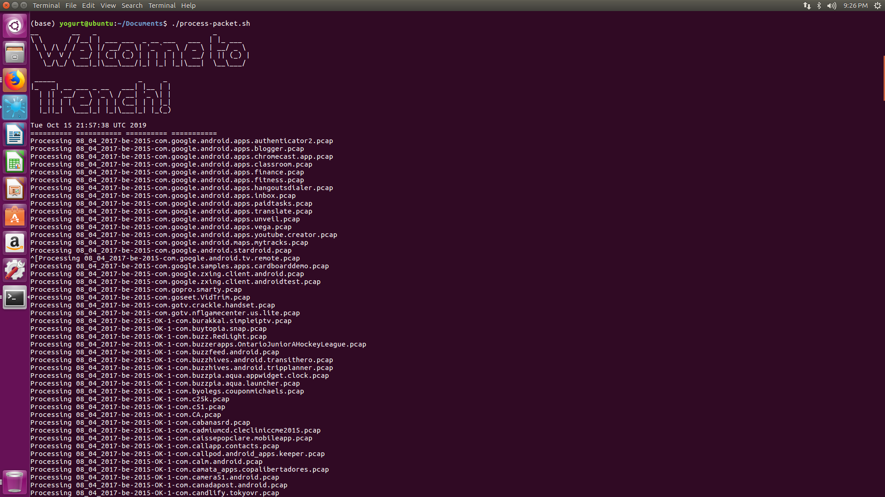

<pre>Author: Dubem Nwoji</pre>
# Machine Learning for Encrypted Network Packet Analysis

### Introduction
<pre> 
Over the years, well-meaning stakeholders have strived to build trust into the internetwork of 
computers that we call the "web". 
In the last two years, however, a changing climate of mistrust has begun to grow and it is no 
surprise it correlates with the exponential growth of data. 

As more and more encryption is leveraged to protect communication and resources in the ever busy 
ebb and flow that is the web, there is a rising threat hidden in the shadows of TLS traffic - <bold> encrypted malware </bold>.

More effective mitigation techniques, such as packet sniffing (break and inspect) require a packet 
be "way-layed", decrypted, and the content, assessed for malicious content, before re-encrypting and 
sending it off on its way (if found to be benign). 
This solution, will necessary, poses a threat to the very trust that we strive to uphold. 
In addition to these privacy concerns is the latency and extra overhead introduced to the network - 
which in huge enterprise settings could lead to significant time and resource loss running into thousands (sometimes millions of dollars).

<b> The Proposal </b> - What if privacy and safety are not mutually exclusive and we can provide 
network administrators, security engineers, and end users, security while upholding trust and privacy?
</pre>
### Provenance
<pre>
Trench is a POC threat intelligence tool that uses machine learning to analyse encrypted network traffic 
for maliciious activity without the need to decrypt packets. 

This project was largely influenced by a <a href = "https://resources.sei.cmu.edu/asset_files/Presentation/2016_017_001_450411.pdf">Cisco research</a> from 2016. As a Data Scientist 
with Network Security background and a knack for seeking out "impossible" challenges (especially as it relates 
to the excitingly blossoming field of security Machine Learning and Privacy Engineering), I was naturally drawn to this problem.

I trained multiple packet capture files (about 20GB) sourced from [Canadian Institute of Cybersecurity, UNB](https://www.unb.ca/cic/datasets/ids-2017.html)    to build my model.
</pre>

### Dependencies
- Python
  - scikit-learn
  - numpy
  - pandas
  - imblearn
- Linux 
- Joy

#### Joy
[Joy](https://github.com/cisco/joy) is a BSD-licensed libpcap-based software package for extracting data features from live network traffic or packet capture (pcap) files, using a flow-oriented model similar to that of IPFIX or Netflow, and then representing these data features in JSON.

#### Setting up Joy
1. Install Joy dependencies:

       [sudo] apt-get update
      
       [sudo] apt-get install gcc git libcurl3 libcurl4-openssl-dev libpcap0.8 libpcap-dev libssl-dev make python python-pip ruby ruby-ffi libz-dev
      
2. Download Joy:
    
       git clone https://github.com/cisco/joy.git
       cd joy

3.  Configure:

        ./configure --enable-gzip
       
4.  Build:
      
        make clean; make

5.  Installation:
  
        sudo ./install_joy/install-sh
        
To run offline:
  
    bin/joy [option] filename
    e.g. bin/joy bidir=1 http=1 dns=1 tls=1 dist=1  data.pcap > data.json
    
    
### How Trench Works

       

Trench takes as input, packet capture files. These files are fed into Joy to extract JSON formatted features including TLS metadata, DNS, HTTP, Netflow, etc depending on the argument passed to "bin/joy ...".

The JSON data is further parsed to extract TLS metadata information as input features to our model.
This features can broadly be categoried as:
1. TLS/SSL Handshake Information:
  - Ciphersuites
  - Extensions
  - Key length
  - Server Certificate
2. Byte Distribution
3. Individual Flow Metadata
4. Netflow Information
